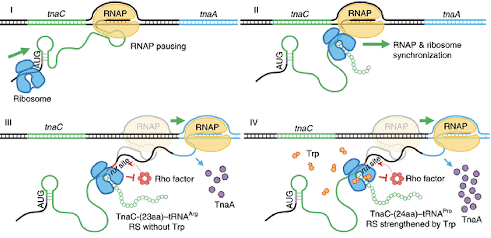
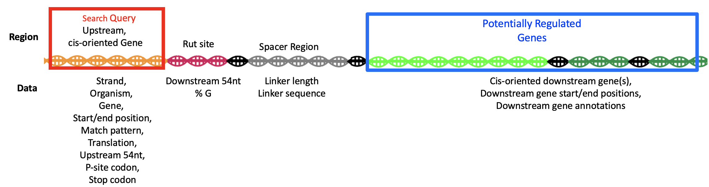
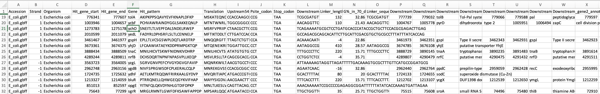

# Background

This script takes in a regular expression (https://www.rexegg.com/regex-quickstart.html) to search for sequences within bacterial genomes. The script can be altered to search genomes one by one via NCBI; however, in practice it was more useful to bulk download genomes for bulk analysis. THe purpose of this script was to scan >10,000 thousand genomes for potential ribosome arrest peptides.  The sequences could then facilitate generation of a bioinformatically-informed library for screening against small molecule inducers to select affected sequences, analagous to tryptophan in the tna operon leader peptide.

<b>Figure 1:</b> Demonstration of the effect of tryptophan on tna operon expression. Schematic from Wang et al. 2020.

The query takes in a regular expression (for example "...........[W,Y,F]...........P") and searches the protein annotations within the bacterial genome for matches.  Once a match is found, it collects contectual information from different regions such as:

| tnaC Region | Rut | Linker | Downstream Gene|
|:-:|:-:|:-:|:-:|
|Strand| Downstream 54nt | Linker length | cis-oriented downstream gene(s)|
|Organism | %G in downstream 70nt| Linker Sequence|Downstream gene start/end positions|
|Gene|||Downstream gene annotations|
|Start/end position||||
|Match pattern||||
|Translation||||
|Upstream 54nt||||
|P-site codon||||
|Stop codon||||

<b>Figure 2:</b> Construction of the motif search algorithm

The output returns a csv for downstream use, such as library generation.

Figure 3: Example output of a motif search for the regular expression "...........[W,Y,F]...........P']", where "']" indicates the end of the translation sequence.

