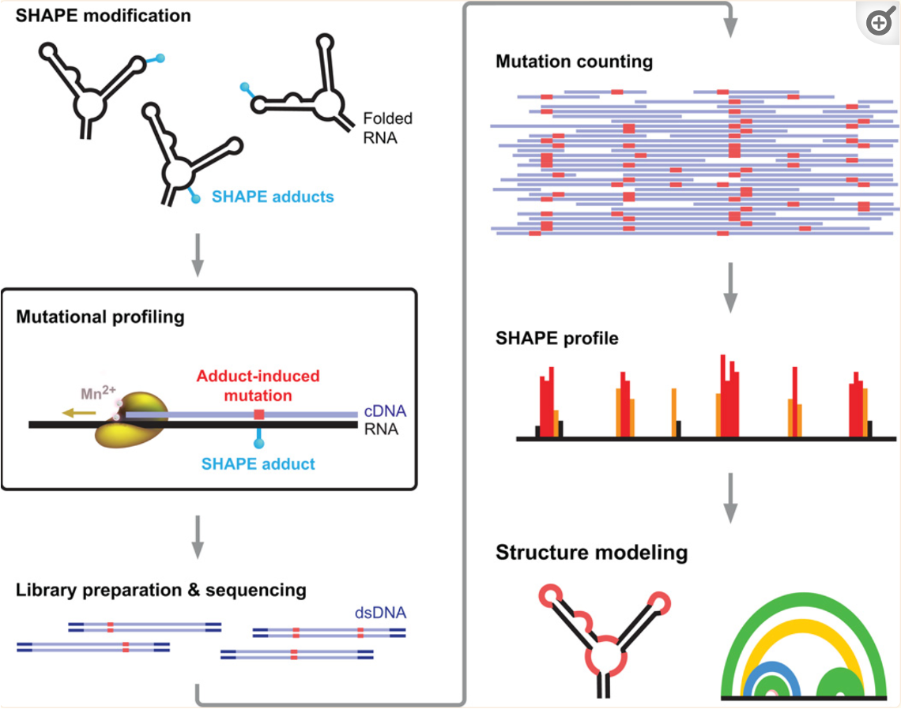
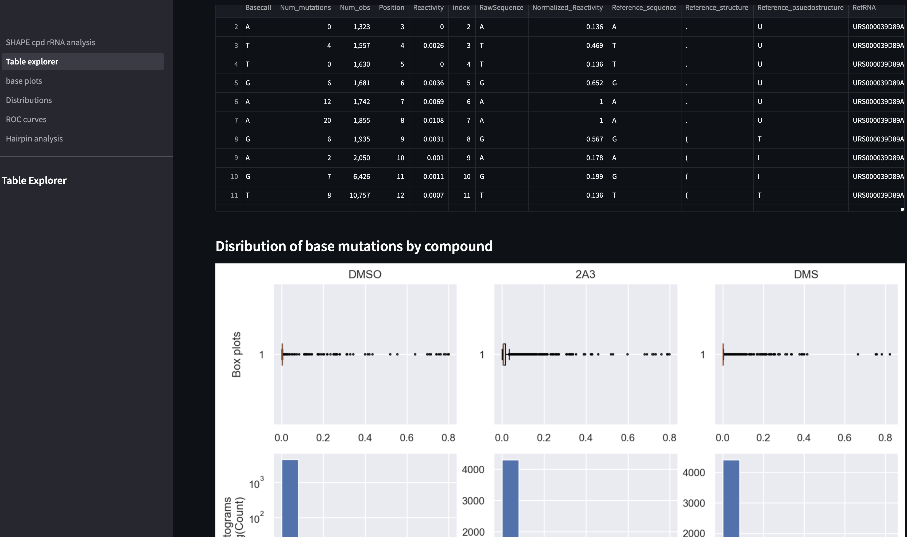
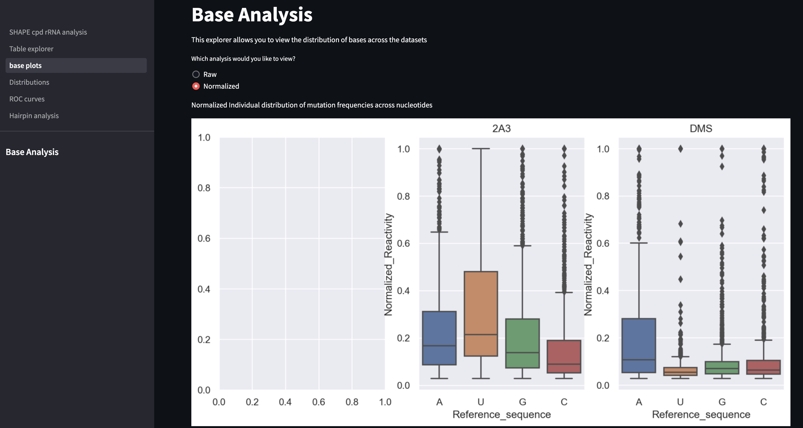
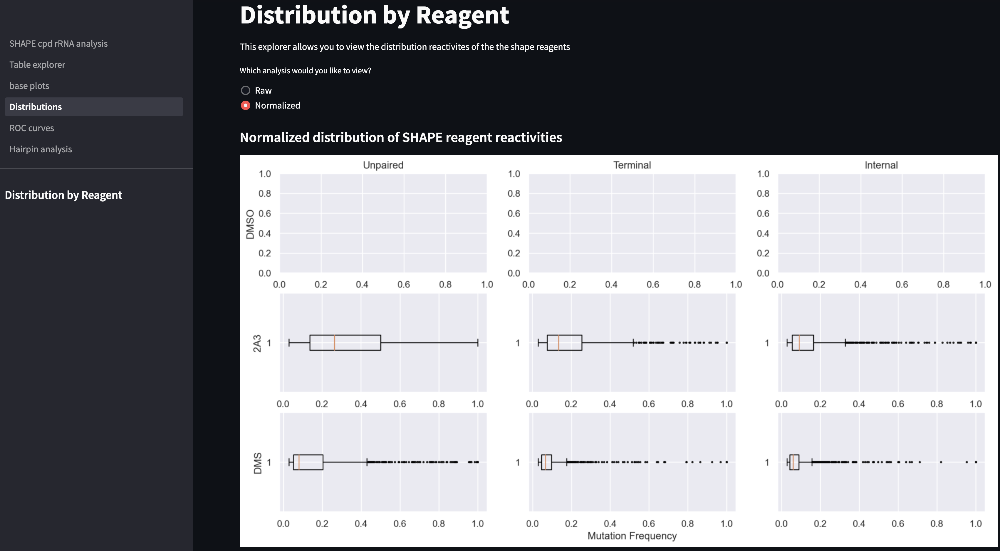
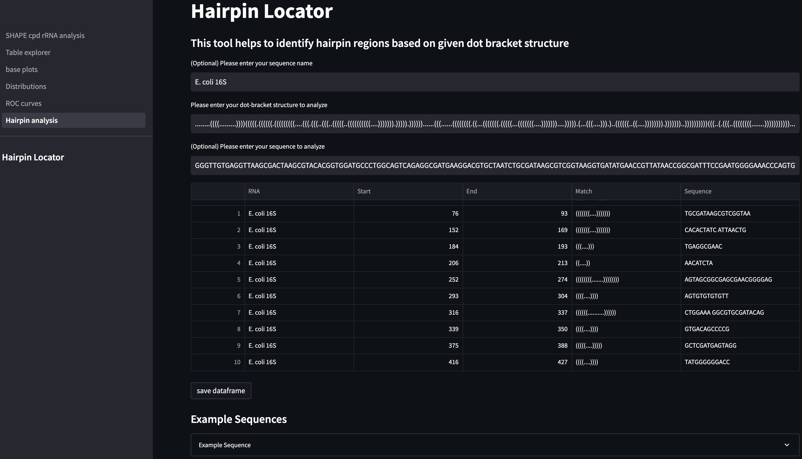
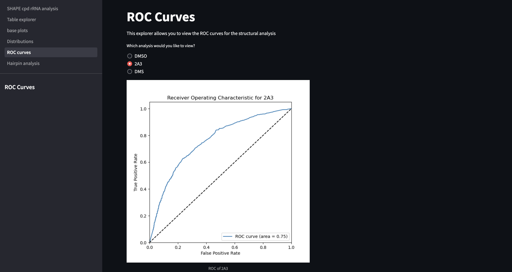

# Background

This package is used to investigate mutational profiling experiments, such as DMS-MaP-Seq or SHAPE-MaP-Seq. In these protocols, exposed RNA nucleotides react with compounds (such as DMS, NAI3, or 2A3) to generate adducts that promote improper base pairing during reverse transcription. The presence of mutations indicate accessibility of the nucleotide in the folded RNA structure and can be used to inform structural prediction.

Figure 1: Overview of RNA mutational profiling for structural prediction. From Siegfried et al. 2014

This pipeline investigates the difference between sequencing data from DMS-MaP-Seq (DMS) and a recently developed compound for SHAPE-MaP-Seq (2A3) relative to no compound (DMSO). DMS is known to methylate the base-pairing face of adenine and cytosine.  SHAPE compounds react with the phosphate backbone on all exposed nucleotides.  The compounds were used to map mutations on the E. <i>coli</i> 16S and 23S rRNA sequences. A summary of the approach is below:
1. Download the appropriate reference data, merge, and format for alignment
2. Download DMS, SHAPE, and DMSO data from the NCBI's Short Read Archive and run QC
3. Align the reads to the reference
4. Perform mutational profiling analysis with RNAFramework and normalize
5. Categorize structural features of reference nucleotides
6. Plot data (can be viewed in report format via Streamlit App)

The result of the pipeline is a Streamlit web app that can be used to communicate findings to experimentalists about structural inference as well as selection of the compound used in experiments. Example screenshots of the web application are below:

# Sources of data used in this work
|Treatment|SRR record|Description|Source|
|:-:|:-:|:-:|:-:|
|DMSO| SRR12235529| GSM4673448: DMSO, E. coli, in vivo (SSII)| https://trace.ncbi.nlm.nih.gov/Traces/?view=run_browser&acc=SRR12235529&display=download|
|2A3|SRR12235536|GSM4673455: 2A3, E. coli, in vivo (SSII)|https://trace.ncbi.nlm.nih.gov/Traces/?view=run_browser&acc=SRR12235536&display=download|
|DMS|SRR6848182|GSM3045709: DMS-MaPseq on E. coli (Total RNA)|https://trace.ncbi.nlm.nih.gov/Traces/?view=run_browser&acc=SRR6848182&display=download|
|||E. coli 16S rRNA FASTA|https://rnacentral.org/api/v1/rna/URS000039D89A.fasta|
|||E. coli 23S rRNA FASTA|https://rnacentral.org/api/v1/rna/URS00019ABAEF.fasta|
|||E. coli 16S Dot-bracket notation| https://rnacentral.org/rna/URS000039D89A/511145|
|||E. coli 23S Dot-bracket notation| https://rnacentral.org/rna/URS00019ABAEF/511145|

# Installation Notes
In addition to the standard packages used in this script (pandas, numpy, biopython, seaborn), several others will need to be installed.  Bash commands were run in the command line and python commands were run in an ipython notebook.

#### RNAFramework
#git clone https://github.com/dincarnato/RNAFramework
#needed to install perl script and alter permissions to be sudo instead of local install
#export PATH=$PATH:$PWD/RNAFramework

#### Sra-toolkit
#curl --output sratoolkit.tar.gz https://ftp-trace.ncbi.nlm.nih.gov/sra/sdk/current/sratoolkit.current-mac64.tar.gz
#tar -vxzf sratoolkit.tar.gz
#export PATH=$PATH:$PWD/sratoolkit.3.0.1-mac64/bin

#### Samtools
#conda install -c bioconda samtools
#needed to run 'conda update samtools'

