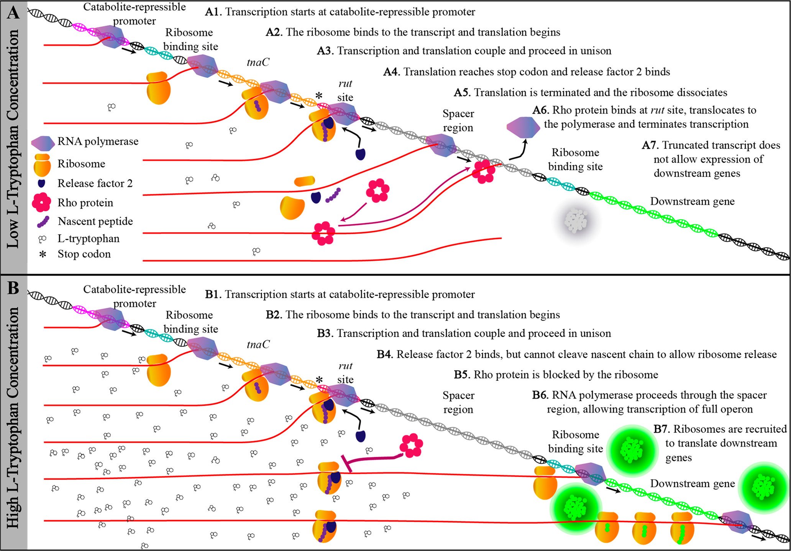
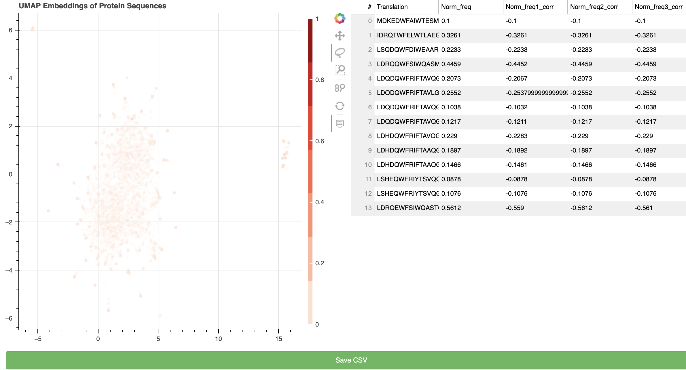

## Background

#### The <i>tna</i> operon

The tryptophanase (<i>tna</i> operon of E. coli and other bacteria controls the influx and breakdown of externally-available tryptophan. In the absence of tryptophan, rho associates with the transcript near the stop codon of <i>tnaC</i> and stops transcription before the polymerase reaches the downstream gene. However, in the presence of high concentrations of externally-available tryptophan, the ribosome stalls at the stop codon of <i>tnaC</i> and occludes rho from associating with the transcript, allowing expression of the downstream genes.

Figure 1: The <i>tnaC</i> mechanism from Gong and Yanofsky, 2002.

#### Assay design
The objective of this study was to sort members of a variant library for their ability to stall the ribosome using a reporter assay in the presence/absence of tryptophan. A plasmid library of over 3,250 bioinformatically-identified variants was derived by searching over 10,000 bacterial genomes using the motif search algorithm. Genscript prepared a plasmid library to incorporate the variants across a 60mer stretch of nucleotides within the <i>tnaC</i> gene.  This regulatory sequence was placed upstream of GFP to induce fluorescence upon ribosome stalling. All of the variants were designed to begin with MNIL (encoded by ATGAATATCCTG) followed by 57 variable nucleotides and a stop codon (TGA or TAA).  
 

Figure 2: Modifications made to the <i>tna</i> operon for the assessment of the variant library. Sherman et al. 2021

The library was cloned into E. coli and those transformed with the library were selected for on LB + kanamycin. The transformed pool was grown to OD~0.7 in LB, starved for tryptophan via a 1:10 dilution into casamino acid media, and then fed tryptophan.  The difference in reporter fluorescence was determined by a cell sorter to enrich members that allowed ribosome stalling. Following grow out, plasmids were isolated from the culture and an NGS library was prepared by amplification from the constant regions on the plasmids.  These were then multiplexed and run on an an Illumina MiSeq.

The reference used in this study was generated by Genscript during their NGS verifiction of the original library (version 3, generated around 5/19/2019).  The 3 libraries were derived from this original via selection methods. 

## Analysis

#### Feature Engineering

This script aims to observe how the distribution of membership changes from the original population to the 3 selected populations.  The purpose is to demonstrate an approach that could be used for directed evolution or pooled screening efforts. The libraries had been pre-processed in 2020 and the semi-processed data files are those available locally. Libary files use either AGGTACC as an anchor (generates a 73 nt variable sequence) or start at the end of the MNIL constant region.

| Library | Method | Start_count | Prot_count |
| :-: | :-: | :-: | :-: |
| Reference | Already trimmed (60nt, 20aas) | 3248 | 3248 |
| lib_1 | Trimmed but doesn't have MNIL as first 4 aas (72nts ~24 aas) | 59529 | 59529 |
| lib_2 | Split with GTACC 24 aas (could incorporate regular expressions to anchor) | 51218 | 860 (25% 'M') |
| lib_3 | Was already split at MNIL (20 aas) | 29804 |29804| 29767|

Table 1: Library file descriptions

Seuqencing data was found to be much more highly variable than the input library of 3,250 sequences, I took two approaches to explore enrichment.   

#### Approach 1: Peptide abundance

The first approach used peptide frequencies under the assumption that any mutation in the process may generate more diversity that could be important at the peptide level, since the free tryptophan is thought to interact with the ribosome and the peptide (not the mRNA) to in the ribosome exit tunnel to stall translation. Library members were computationally translated and each variant was counted. Relative proportion of membership for terminal peptides were calculated. The terminal region of <i>tnaC</i> is responsible for stalling the ribosome, so if cloning did not go as expected, the terminal region could still be responsible for signal.Sequences were then encoded using one-hot encoding (padded with "-") and mapped with their colors coordinating with their levels of enrichment.  There are scripts to investigate individual libaries as well as libraries normalized to the input library from Genscript.

#### Approach 2: Nucleotide abundance of original library members

Figure 3: UMAP representation of lib_3 protein sequences demonstrate clustering around a nuclear point with most reads

Results from specific libraries using the first approach suggested that data may be clustered around original library members and may have incorporated mutations as artifacts during the library prep process. Even points just one amino acid away from the major variant of the cluster is almost 0 when it comes to frequency, suggesting that this effect may be an artifact. To account for this potential effect, variants are mapped back to their closest original library member via Levenshtein distance. The freqencies were then calculated and normalized and encoded for graphing as above.

| Model | Description | Substitutions | Indels |
| :-: | :-: | :-: | :-: |
| Hamming distance | measures the number of substitutions from one string to another. Requires fixed length| X ||
|Levenshtein distance | measures edit distance between strings (Best for this use case because we expect artifact mutations) | X | X | 
|Smith-Waterman algorithm| identifies regions of similarity between two sequences | X | X |
|Needleman-Wunsch algorithm| global alignment to compare two sequences and identify regions of similarity| X | X | X |
|Blosum Matrix| Substitution matrix that assigns scores to each possible amino acid substitution based on the frequency of occurrence of the substitution in known protein sequences | X|X|
|Phylogenetic analysis| Compares multiple amino acid sequences via construction of a phylogenetic tree and measures branch lengths ||

Table 2: Models for measuring distance between peptides

Note: Some analyses may have the values corrected by the frequency of the original library to provide a measure of enrichment.  This value is calcuated by the following example formula: Norm_freq1_corr=ref_123_df['Norm_freq1']-ref_123_df['Norm_freq'],

## Interactive plots

Once the script has been run, it generates a series of output files for interactive data exploration (umap_df_nuc.csv and umap_df_pepl.csv). In order to use this in interactive mode, a user would have to save the dataframe of interest. Now, standalone apps can be run for the peptide sequences or the clustered nucleotide sequences. Variants of interest can be selected using the lasso tool and extracted to a CSV.

1. Using the terminal, activate the virtual environment with bokeh \
2. Set the library to the one you want to view \
3. Enter the command from the main folder: 
    - bokeh serve --show ./code/nuc_app.py 
    - bokeh serve --show ./code/pep_app.py

While the server is running, the user can use the lasso tool to select points of interest, see those points populate a table with relevant data (sequence, frequency in Genscript library (Norm_freq), as well as the frequency in each one of the libraries).  Once the relevant points are extracted, they can be saved and used in downstream analysis!

Figure 4: A view of the web app used to extract features of interset.  In this analysis, a portion of the cluster to the right was selected.
